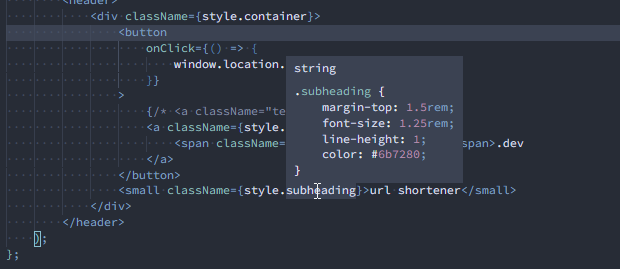

# CSS Modules Better Intellisense

Quickly view the styles behind any class in your CSS modules. Simply hover over the class name and this extension will find the correct import, locate the class, and display the associated CSS properties.

## Issues

If you find any bugs or have a feature request, please open a new issue in the [Github repository](https://github.com/Limeoats/css-modules-better-intellisense/issues).

## License

This project is under the [MIT License](https://github.com/Limeoats/css-modules-better-intellisense/blob/main/LICENSE).

## Support

If you find this extension helpful and would like to say thank you, feel free to click the button below and buy me a coffee!

## Contact

Limeoats - [@Limeoats](https://twitter.com/limeoats) - oats@limeoats.com

Project Link: [https://github.com/Limeoats/css-modules-better-intellisense](https://github.com/Limeoats/css-modules-better-intellisense)
